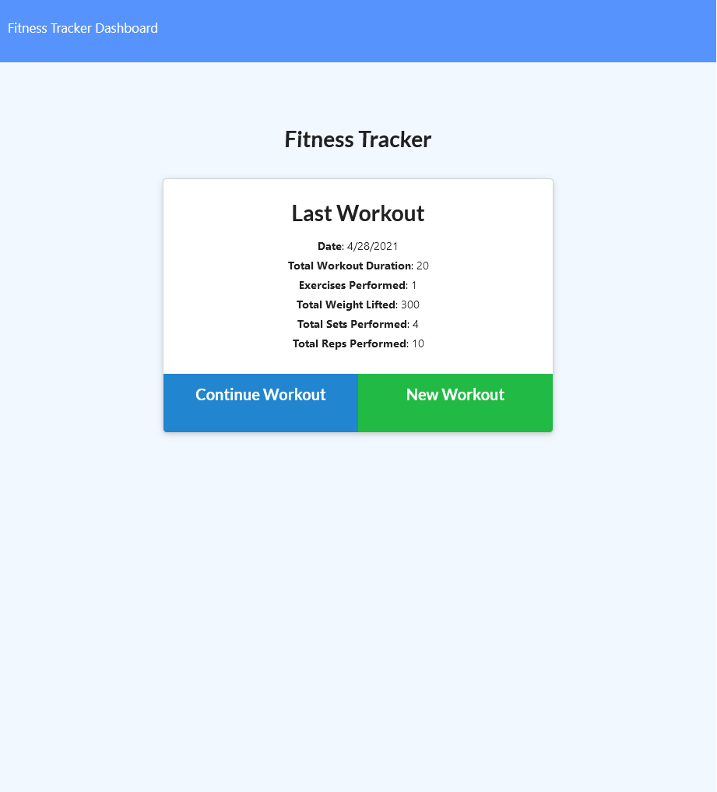
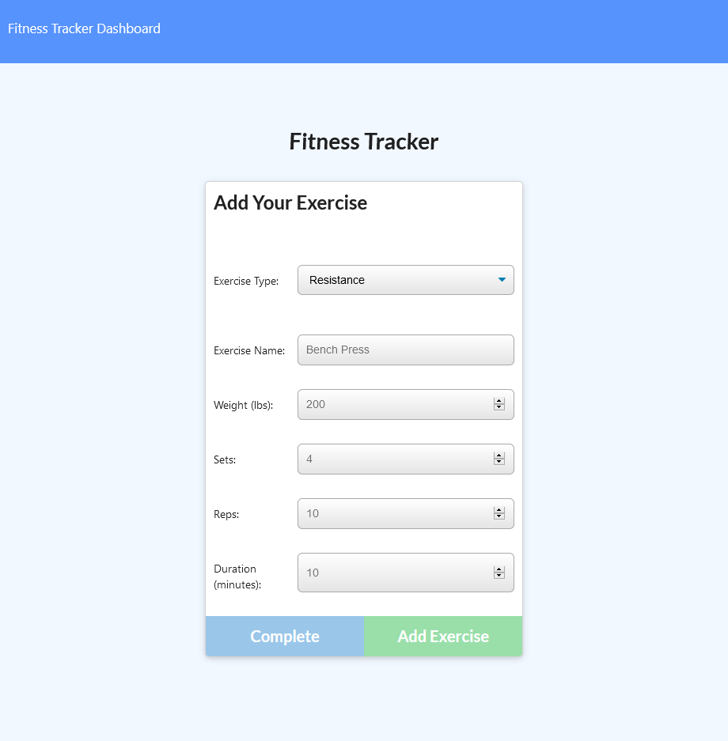
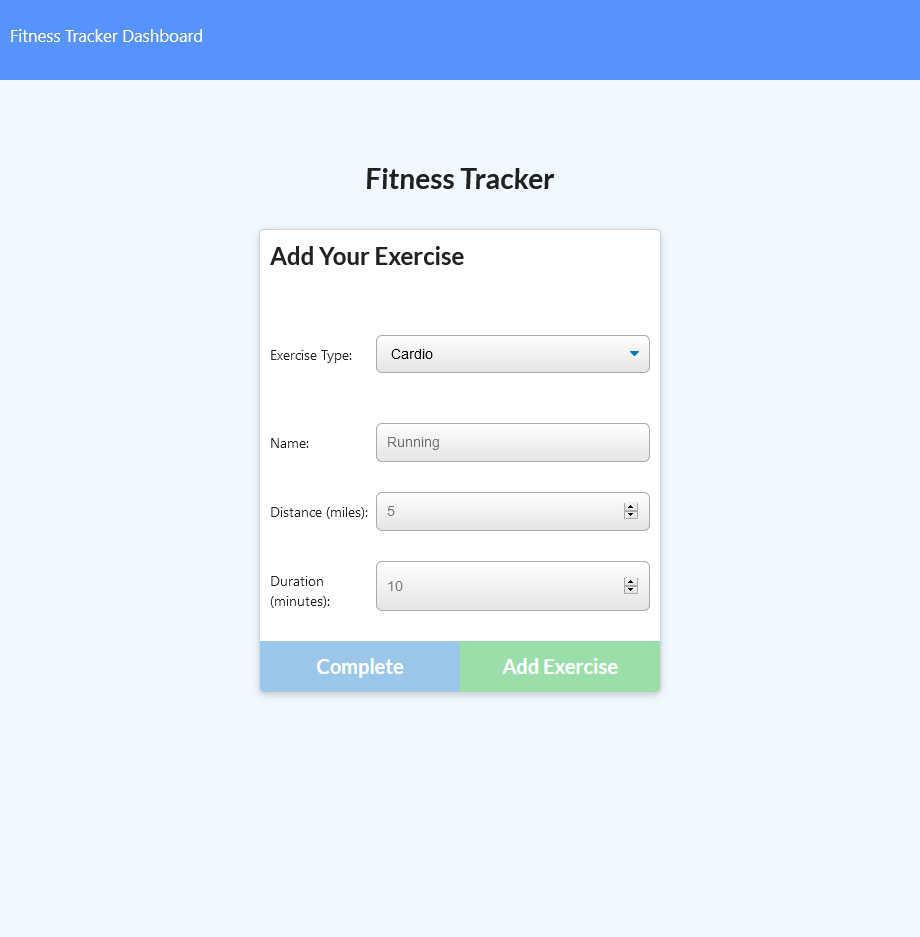
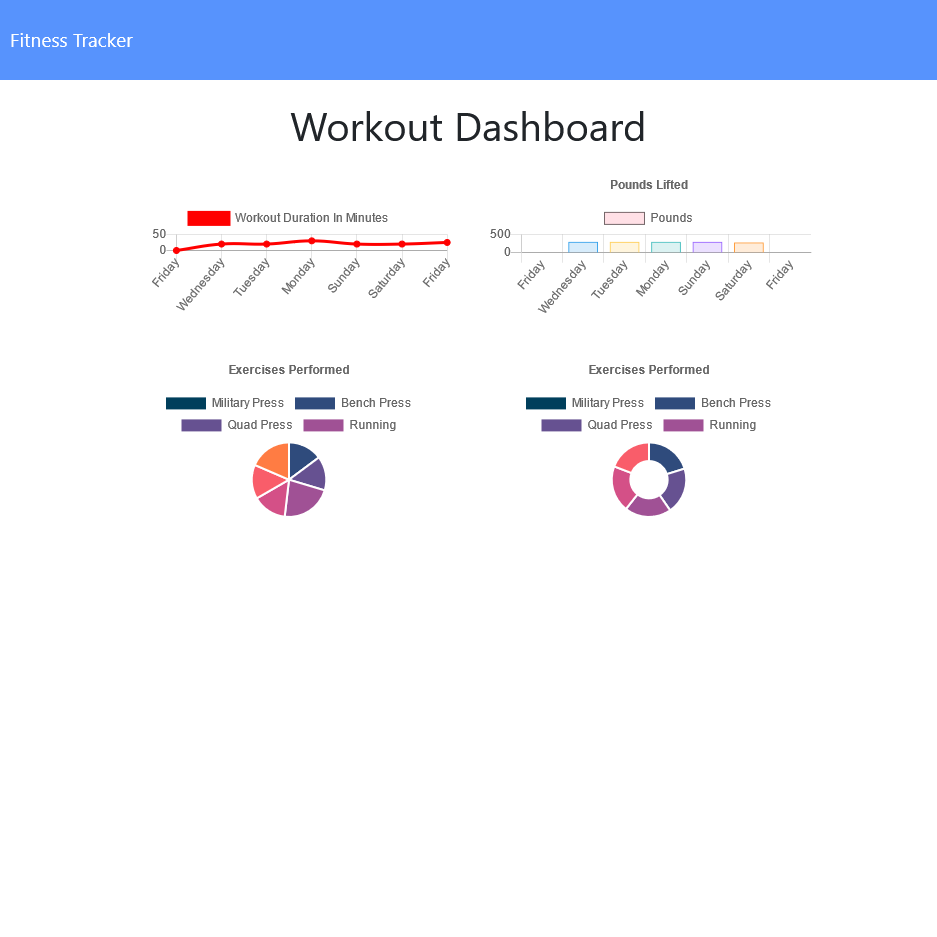

# Workout_Tracker
An application that allows the creation and tracking of daily workouts.
## Table of Contents
- [Live Link](#Live-Link)
- [Repository Link](#Repository-Link)
- [Code Description](#Code-Description)
- [Installation](#Installation)
- [Function](#Function)
- [Screenshots](#Screenshots)
## Live Link
https://evening-shelf-00754.herokuapp.com/
## Repository Link
https://github.com/riraq/Workout_Tracker
## Code Description
The front end code was provided and a backend was requested that would utilize a Mongo database using a Mongoose Schema and the routes to be handle through Express. 
## Installation
1. Clone the repository from https://github.com/riraq/Workout_Tracker.
2. Run "npm i" in the main directory of the application in order to install dependencies.
3. Use "npm run seed" in the terminal while in the root folder if example data is needed.
## Function
The application functions by starting on the home page. From the index, a user can add a workout, continue a workout or go to their dashboard to see a summary of their previous workouts. If a workout is created or continued, the user will e taken to a new page that allows the addition of exercises to the workout. The user can choose between Resistance or Cardio and depending on the selection, the appropriate form fields will appear. When the user fills out the form, they can add another exercise to the workout or complete the workout. When the dashboard link in the navbar is selected, it takes the user to the stats page and shows a summary of their workouts for the past 7 days.
## Screenshots
### Home Page 

### Resistance

### Cardio

### Stats
